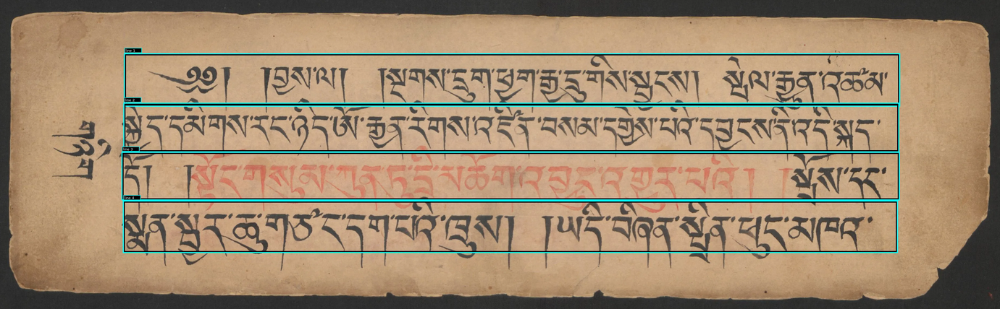

# PechaBridge Workbench

## Project Description

PechaBridge is a workflow for **Tibetan document understanding** with a focus on training OCR and Line Segmentation models for text retrieval in Tibetan script.

The primary entrypoint for end-to-end usage is the **OCR Workbencg** (`ui_ocr_workbench.py`).

## Example: SBB Pecha OCR

The figure below shows an example line segmentation result for a Tibetan pecha
page from the Staatsbibliothek zu Berlin (SBB). Each detected line is passed
through the OCR model to extract the Tibetan text.



Sample OCR output for the page shown above:

``` 
༄༅། །བྱས་ལ། །སྔགས་དྲུག་ཕྱག་རྒྱ་དྲུག་གིས་སྦྱངས། སྤེལ་རྒྱུན་ཤཚམ།
སྐྱིད་དམིགས་དང་ཉིད་ཨོ་རྒྱན་རིགས་འཛིན་བསམ་དགྱེས་པའི་དབྱངས་ནི་འདི་སྐད་
དོ། །སྟོང་གསུམ་ཀུན་ནི་མཆོག་འབུན་འགྱར་བའི། །སྤོས་དང་
སྨན་སྦུར་ཆུ་གཙང་དག་བཞི་ཁྲུས། །ཡ དི་བཞིན་སྲིན་ཕུད་མཁན་
``` 

```markdown
> ⚠ The transcript above is an early-stage model output and may contain
> recognition errors. Accuracy improves with more training data.
``` 

## Core Features

- **Synthetic multi-class dataset generation**: Creates YOLO-ready pages for Tibetan number words, Tibetan text blocks, and Chinese number words.
- **OCR-ready target export**: Optionally saves rendered OCR targets with deterministic line linearization and optional OCR crop export by label.
- **Standalone DONUT/TroCR OCR training**: Trains OCR directly on OpenPecha/BDRC line manifests (`train-donut-ocr`) with `none|pb|gray|bdrc|rgb` image preprocessing and CER evaluation.
- **Retrieval encoder training + eval**: Trains ViT/DINOv2 patch encoders with mp-InfoNCE and exports FAISS-ready embeddings plus cross-page evaluation.
- **Dual vision-text encoder (CLIP-style) training**: Trains DINOv2 + text encoder (e.g. ByT5) on line image/text manifests (`line_clip`) for text-to-line and line-to-text retrieval.


## Install

```bash
pip install -r requirements.txt
```

`requirements.txt` is now the **unified** dependency file for the repository.

Legacy files `requirements-ui.txt`, `requirements-vlm.txt`, and `requirements-lora.txt` remain as compatibility wrappers.

## Pretrained Models

Pretrained PechaBridge models are hosted on HuggingFace:

| Model | HuggingFace Repo | Description |
|-------|-----------------|-------------|
| DONUT OCR | [`TibetanCodexAITeam/PechaBridgeOCR`](https://huggingface.co/TibetanCodexAITeam/PechaBridgeOCR) | VisionEncoderDecoder OCR for Tibetan line images |
| Line Segmentation | [`TibetanCodexAITeam/PechaBridgeLineSegmentation`](https://huggingface.co/TibetanCodexAITeam/PechaBridgeLineSegmentation) | YOLO segmentation model for Tibetan text lines |

### Download (one command)

```bash
# Download both models into models/ (auto-detected by UI and CLI):
python cli.py download-models

# Download only the OCR model:
python cli.py download-models --models ocr

# Download only the line segmentation model:
python cli.py download-models --models line

# Force re-download:
python cli.py download-models --force
```

After download the directory layout is:

```
models/
  ocr/
    PechaBridgeOCR/          ← DONUT checkpoint (auto-detected by ui_ocr_workbench.py)
      config.json
      model.safetensors
      tokenizer_config.json
      preprocessor_config.json
      repro/
        image_preprocess.json
        generate_config.json
  line_segmentation/
    PechaBridgeLineSegmentation.pt   ← YOLO .pt (auto-detected by ui_workbench.py)
```

Both UI workbenches (`ui_ocr_workbench.py`, `ui_workbench.py`) scan these directories on startup and populate their model dropdowns automatically — no manual path configuration needed.

### Batch OCR with downloaded models

```bash
python cli.py batch-ocr \
    --ocr-model    models/ocr/PechaBridgeOCR \
    --line-model   models/line_segmentation/PechaBridgeLineSegmentation.pt \
    --layout-engine yolo_line \
    --engine donut \
    --input-dir /path/to/pecha/images
```

## OCR Workbench

The **OCR Workbench** (`ui_ocr_workbench.py`) is a dedicated Gradio UI for interactive Tibetan OCR on pecha page images.

```bash
python ui_ocr_workbench.py
```

### Quick Start

1. **Download the pretrained models** (once):
   ```bash
   python cli.py download-models
   ```

2. **Start the workbench** — models are auto-detected from `models/ocr/` and `models/line_segmentation/`.

3. **Upload a pecha page image** and click **Run OCR**.

### Modes

| Mode | Description |
|------|-------------|
| **Fully Automatic OCR** | Segments all lines on the page, runs OCR on each, and returns the full transcript. |
| **Manual Mode** | Click a line on the page or draw a bounding box with two clicks to OCR a single region. |

### Line Segmentation Backends

| Backend | When to use |
|---------|-------------|
| **Classical CV** | Fast, no GPU needed. Works well on clean woodblock prints. Requires a YOLO layout model (`models/layout/`). |
| **Pretrained YOLO Model** | Best accuracy for complex or degraded pages. Uses `models/line_segmentation/PechaBridgeLineSegmentation.pt`. |
| **BDRC Line Model** | Alternative ONNX-based segmentation from the BDRC Tibetan OCR app. Auto-downloaded on first use. |

### OCR Engines

| Engine | Description |
|--------|-------------|
| **DONUT** | Default. VisionEncoderDecoder model from `models/ocr/PechaBridgeOCR/`. Preprocessing pipeline is auto-detected from the checkpoint's repro bundle. |
| **BDRC OCR** | ONNX-based CTC OCR from the BDRC Tibetan OCR app. Auto-downloaded on first use. |

### Typical Workflow (Automatic Mode)

```
Upload page image
  → Select line segmentation backend (YOLO recommended)
  → Select OCR engine (DONUT)
  → Click "Run OCR"
  → Inspect annotated page + transcript
  → Save results
```

### Notes

- The DONUT model and YOLO line segmentation model are loaded once and cached in memory for the session.
- The preprocessing pipeline (`bdrc`, `gray`, `rgb`) is read automatically from `repro/image_preprocess.json` inside the checkpoint — no manual selection needed when using downloaded models.
- For remote server usage, use SSH port forwarding and keep `UI_SHARE=false`.

## Running the Workbench

Both `ui_ocr_workbench.py` and `ui_workbench.py` accept optional runtime flags via environment variables:

```bash
export UI_HOST=127.0.0.1   # use 0.0.0.0 for remote server binding
export UI_PORT=7860
export UI_SHARE=false      # set true only if you explicitly want a public Gradio link
python ui_ocr_workbench.py  # or ui_workbench.py
```

For remote server usage, keep `UI_SHARE=false` and use SSH port forwarding:

```bash
ssh -L 7860:127.0.0.1:7860 <user>@<server>
```

Then open `http://127.0.0.1:7860` on your laptop.

## Unified CLI

The project includes a unified CLI entrypoint:

```bash
python cli.py -h
```

Key commands:

```bash
# Texture LoRA dataset prep
python cli.py prepare-texture-lora-dataset --input_dir ./sbb_images --output_dir ./datasets/texture-lora-dataset

# Train texture LoRA (SDXL or SD2.1 via --model_family)
python cli.py train-texture-lora --dataset_dir ./datasets/texture-lora-dataset --output_dir ./models/texture-lora-sdxl

# Texture augmentation inference
python cli.py texture-augment --input_dir ./datasets/tibetan-yolo-ui/train/images --output_dir ./datasets/tibetan-yolo-ui-textured

# Train image encoder (self-supervised)
python cli.py train-image-encoder --input_dir ./sbb_images --output_dir ./models/image-encoder

# Train text encoder (unsupervised, Unicode-normalized)
python cli.py train-text-encoder --input_dir ./data/corpora --output_dir ./models/text-encoder

# Generate patch retrieval dataset (YOLO textbox -> lines -> multi-scale patches)
python cli.py gen-patches \
  --model ./models/layoutModels/layout_model.pt \
  --input-dir ./sbb_images \
  --output-dir ./datasets/text_patches \
  --no-samples 20 \
  --debug-dump 5

# Generate weak OCR labels for patch crops (optional retrieval weak positives)
python cli.py weak-ocr-label \
  --dataset ./datasets/text_patches \
  --meta ./datasets/text_patches/meta/patches.parquet \
  --out ./datasets/text_patches/meta/weak_ocr.parquet

# Mine cross-page MNN positives for retrieval training
python cli.py mine-mnn-pairs \
  --dataset ./datasets/text_patches \
  --meta ./datasets/text_patches/meta/patches.parquet \
  --out ./datasets/text_patches/meta/mnn_pairs.parquet \
  --config ./configs/mnn_mining.yaml \
  --num-workers 8

# Train patch retrieval encoder with mp-InfoNCE (MNN/OCR/both)
python cli.py train-text-hierarchy-vit \
  --dataset-dir ./datasets/text_patches \
  --output-dir ./models/text_hierarchy_vit_mpnce \
  --model-name-or-path facebook/dinov2-base \
  --train-mode patch_mpnce \
  --positive-sources both \
  --pairs-parquet ./datasets/text_patches/meta/mnn_pairs.parquet \
  --weak-ocr-parquet ./datasets/text_patches/meta/weak_ocr.parquet

# Train line-level dual vision-text encoder (CLIP-style) on OCR manifests
python cli.py train-text-hierarchy-vit \
  --dataset-dir ./datasets/openpecha_ocr_lines \
  --output-dir ./models/line_clip_openpecha_bdrc_dinov2_byt5 \
  --train-mode line_clip \
  --train-manifest ./datasets/openpecha_ocr_lines/train/meta/lines.jsonl \
  --val-manifest ./datasets/openpecha_ocr_lines/eval/meta/lines.jsonl \
  --model-name-or-path facebook/dinov2-base \
  --text-encoder-name-or-path google/byt5-small \
  --image-preprocess-pipeline bdrc

# Warm line_clip workbench corpus cache (best model auto-selected)
python cli.py warm-line-clip-workbench-cache \
  --models-dir ./models \
  --dataset-root ./datasets/openpecha_ocr_lines \
  --splits eval,test \
  --only both \
  --device cpu

# Probe best line_clip model on random samples (in-split and/or cross-split)
python cli.py probe-line-clip-workbench-random-samples \
  --dataset-root ./datasets/openpecha_ocr_lines \
  --cross-split eval:test \
  --samples-per-split 200 \
  --summary-only

# Train Donut/TroCR OCR directly on line manifests (with CER on eval split)
python cli.py train-donut-ocr \
  --train_manifest ./datasets/openpecha_ocr_lines/train/meta/lines.jsonl \
  --val_manifest ./datasets/openpecha_ocr_lines/eval/meta/lines.jsonl \
  --output_dir ./models/donut_openpecha_rgb \
  --model_name_or_path microsoft/trocr-base-stage1 \
  --tokenizer_path openpecha/BoSentencePiece \
  --image_preprocess_pipeline rgb

# Cross-page FAISS evaluation from exported embeddings
python cli.py eval-faiss-crosspage \
  --embeddings-npy ./models/text_hierarchy_vit_mpnce/faiss_embeddings.npy \
  --embeddings-meta ./models/text_hierarchy_vit_mpnce/faiss_embeddings_meta.parquet \
  --mnn-pairs ./datasets/text_patches/meta/mnn_pairs.parquet \
  --output-dir ./models/text_hierarchy_vit_mpnce/eval_crosspage

# Full label-1 OCR workflow (generate -> prepare -> train)
python cli.py run-donut-ocr-workflow \
  --dataset_name tibetan-donut-ocr-label1 \
  --dataset_output_dir ./datasets \
  --font_path_tibetan "ext/Microsoft Himalaya.ttf" \
  --font_path_chinese ext/simkai.ttf \
  --model_output_dir ./models/donut-ocr-label1
```

## Model Outputs And Workbench Compatibility

### DONUT/TroCR OCR (`train-donut-ocr`)

Typical outputs in `--output_dir`:

- `checkpoint-*` (step-based HF checkpoints)
- `checkpoint-epoch-<N>-cer-<X>` symlink aliases (if eval happened before save)
- `model/` (final `VisionEncoderDecoderModel`)
- `tokenizer/`
- `image_processor/`
- `train_summary.json`

Each checkpoint also contains a `repro/` bundle with:
- `repro/image_preprocess.json` — preprocessing pipeline name (`bdrc`, `gray`, `rgb`)
- `repro/generate_config.json` — generation parameters (max_length, decoder_start_token_id, …)
- `repro/tokenizer/` + `repro/image_processor/` — self-contained copies for reproducibility

Current Workbench support:

- The Workbench supports the **DONUT OCR workflow runner** (`run-donut-ocr-workflow`) and monitors training logs/output dirs.
- `ui_ocr_workbench.py` auto-scans `models/ocr/` for checkpoints and exposes them in the DONUT dropdown.
- Training and evaluation are fully supported via CLI (`cli.py train-donut-ocr`).

### Dual Vision-Text Encoder (`train-text-hierarchy-vit --train-mode line_clip`)

Typical outputs in `--output_dir`:

- `text_hierarchy_vit_backbone/` (image backbone + image processor)
- `text_hierarchy_projection_head.pt` (image projection head)
- `text_hierarchy_clip_text_encoder/` (HF text encoder + tokenizer)
- `text_hierarchy_clip_text_projection_head.pt` (text projection head)
- `faiss_embeddings.npy`, `faiss_embeddings_meta.parquet`
- `training_config.json`
- optional `checkpoint_step_*` snapshots (image backbone/head checkpoints)

Current Workbench support:

- The Workbench can scan and use the **image backbone + image projection head** for line/block encoding previews and FAISS-related UI flows.
- The **text encoder part** of `line_clip` is currently **not yet consumed by the Workbench UI** (text query encoding remains a CLI / future UI extension topic).
- Training artifacts are therefore usable in the UI for image-side encoding, while full dual-encoder evaluation is primarily CLI-driven.

## Label Studio Notes

For local file serving in Label Studio, set:

```bash
export LABEL_STUDIO_LOCAL_FILES_SERVING_ENABLED=true
export LABEL_STUDIO_LOCAL_FILES_DOCUMENT_ROOT=/absolute/path/to/your/dataset/root
```

Then use the Workbench export actions.

## Documentation Guide

- **NEW:** Full DONUT OCR training playbook (Tiny-Pretraining, Anti-Collapse, Full-Run recipes): [docs/donut_training_guide.md](docs/donut_training_guide.md)
- CLI command reference and end-to-end examples: [README_CLI.md](README_CLI.md)
- Pseudo-labeling and Label Studio workflow: [README_PSEUDO_LABELING_LABEL_STUDIO.md](README_PSEUDO_LABELING_LABEL_STUDIO.md)
- Patch dataset generation (YOLO textbox -> lines -> sub-patches): [docs/dataset_generation.md](docs/dataset_generation.md)
- Robust MNN mining for cross-page positives: [docs/mnn_mining.md](docs/mnn_mining.md)
- Retrieval training with mp-InfoNCE (MNN/OCR weak positives): [docs/retrieval_mpnce_training.md](docs/retrieval_mpnce_training.md)
- DONUT/TroCR OCR training (OpenPecha/BDRC manifests, CER, checkpoints): [README_DONUT_OCR.md](README_DONUT_OCR.md)
- Line-CLIP dual vision-text encoder training (DINOv2 + text encoder): [README_LINE_CLIP_DUAL_ENCODER.md](README_LINE_CLIP_DUAL_ENCODER.md)
- line_clip cache warmup + in-split/cross-split probing & evaluation guide: [docs/line_clip_dual_encoder_probe_guide.md](docs/line_clip_dual_encoder_probe_guide.md)
- Weak OCR labeling for patch datasets: [docs/weak_ocr.md](docs/weak_ocr.md)
- Diffusion + LoRA details: [docs/texture_augmentation.md](docs/texture_augmentation.md)
- Retrieval roadmap: [docs/tibetan_ngram_retrieval_plan.md](docs/tibetan_ngram_retrieval_plan.md)
- Chinese number corpus note: [data/corpora/Chinese Number Words/README.md](data/corpora/Chinese%20Number%20Words/README.md)

## License

MIT, see [LICENSE](LICENSE).
